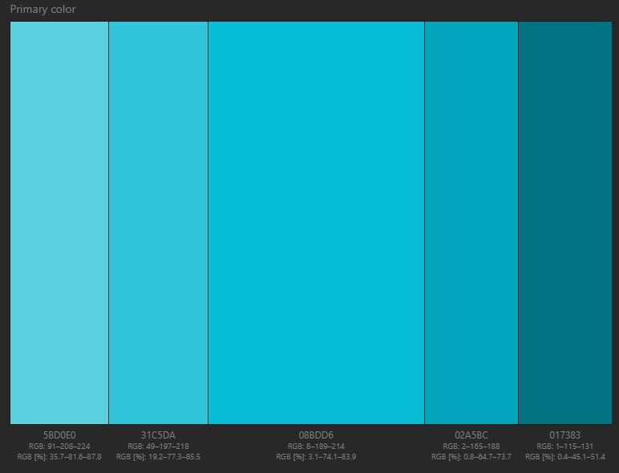

# Phone company

**retail company for moblie phones**

# customers 

+ they need faster loading times on the websie
+ it needs to look good so they can make money of it
+ easily accessible
+ it needs to be simple to navigate
+ product informaton

# owners

+ professional 
+ generate buisness and generate money
+ cheap

# develpoers

+ well documented, easy to maintain
+ quick and easy to implement
+ easy to test
+ timing

+ design
+ colours
+ layout

# primary colour scheme

+ hue: 215
+ base RGB: 08BDD6
+ Palette URL: http://paletton.com/#uid=13l0u0kvoNEjlR1phP4LXFaKfqO
+ #####  Color Palette by Paletton.com

 + I will be using this colour scheme for the background on the phone pages

# Text colour
+ hue: 302
+ Base RGB: 747474
+ Palette URL: http://paletton.com/#uid=14J0u0k00lU00++04yj02bCaY20
+ #####  Color Palette by Paletton.com

  
+ reason for red being my clour choice is because it will be the colour of the text font that I'm going to use

#####  Generated by Paletton.com (c) 2002-2014

# fonts

# main
+ I will be using Breeze Sans font because it is used by Samsung and Samsung is a popular phone company.
+ I searched for a website called fontesk and downloaded the font
+ https://fontesk.com/breeze-sans-font-family/
+ Also I might use Arial because it's popular   

# second option
+ The second font I will be using is callled Roboto because it was developed by google.
+ I used Google fonts to get this font
+ https://fonts.google.com/?query=Roboto

# copyright
+ Samsung Z Fold https://www.notebookcheck.net/fileadmin/Notebooks/News/_nc3/Z_Fold_3_0.jpg
+ iPhone 11 Pro Max https://images.app.goo.gl/4rxB6qqqNr1Ae2y9A
+ iPhone 12 https://media.4rgos.it/s/Argos/8481731_R_SET?$Main768$&w=620&h=620
+ iPhone 13 https://store.storeimages.cdn-apple.com/4668/as-images.apple.com/is/iphone-13-blue-select-2021?wid=470&hei=556&fmt=jpeg&qlt=95&.v=1629842712000
+ samsung s21 https://www.backmarket.co.uk/second-hand-samsung-galaxy-s21-5g-128-gb-grey-unlocked/451238.html?shopping=gmc&gclid=EAIaIQobChMI9p7srP-u9wIV2OvtCh2z-QPLEAQYBSABEgKPgPD_BwE#?l=12
+ iphone 11 https://store.storeimages.cdn-apple.com/4668/as-images.apple.com/is/refurb-iphone-12-pro-max-silver-2020?wid=1144&hei=1144&fmt=jpeg&qlt=90&.v=1635202946000
+ iphone 11 pro max https://www.backmarket.co.uk/second-hand-iphone-11-pro-max-64-gb-midnight-green-unlocked/290048.html?shopping=gmc&gclid=EAIaIQobChMIuInoj7S09wIVl-FRCh2ISQjbEAQYASABEgIUv_D_BwE#?l=12
+ alcate 3l https://www.alcatelmobile.com/wp-content/uploads/2021/02/ALcatel-3L-2021-513x599-1.png
+ Nokia xr 20 https://www.notebookcheck.net/fileadmin/Notebooks/Nokia/XR20/4_zu_3_Nokia_XR20.jpg
+ oppo a76 https://d3eys52k95jjdh.cloudfront.net/wp-content/uploads/2022/02/oppo-a76-renkler-1024x576.jpg
+ Motorola g200 https://med.csmobiles.com/299404-large_default/motorola-moto-g200-5g-8gb-128gb-dual-sim-azul.jpg
+ huawei p40 pro https://m.media-amazon.com/images/I/61XM1qbUPUL._AC_SX522_.jpg
+ Lg G7 thinq https://www.starcity.pk/wp-content/uploads/2022/02/lg-g7-thinq-1.jpg

# videos
+ iphone 12: <iframe width="1280" height="640" src="https://www.youtube.com/embed/Sx6dAx7dnXg" </iframe>
+ iphone 13: <iframe width="1280" height="640" src="https://www.youtube.com/embed/Fop2oskTug8" </iframe>
+ samsung s21 <iframe width="1237" height="696" src="https://www.youtube.com/embed/LjzkSwyRoxY" </iframe> 
 
# navagation
+ when you click on a photo a seperate tab will open revealing more information about the product

+ on the support page I am working on making the logos of the social medias to workn (instagram, facebook, twitter)

+ To navigate on the home page just click on the phone and that phone page will apear. Same applys for (contact, accessoires and store)

&check;
            |home   |search| |logo | accessories| information| help 
home        |
            |
search      |
            |
logo        |
            |
accessories |
            |
information |
            |
help        |

# measurements for the first website
+ logo height 130px width 108 px
+ search bar height 40px width 291px
+ sign up logo height 130px width 108p
+ information box height 101px width 279px
+ information height 105.78 px width 277.69 px
+ accessories, sims and offers box height 125 px width 743 px
+ offers height 52.18 px width 119.95 px 
+ accessories height 52.18 px width 229.82 px
+ sims height 77.81px width 143.53 px
+ samsung s21 front height 182px width 87px
+ samsung s21 back height 180px width 84
+ Iphone 13 height 240px width 176 px
+ huawei p40 pro front height 101px width 84px
+ huawei p40 pro back height 181px width 84px
+ apple logo height 53px width 66px
+ samsung logo height 49px width 186px
+ huawei logo height 62px width 240px

# Story Board

# this website is for my my assignment and it is to be viewed on github

# To be designed at a later date
+ Functional social media

# review
+ Aiden
The buttons look neat and clean, could do with highlight when hovering over.
The Phone products look nice, It's very visible and prominent, missing a buy button and clear price tag.

Overall 8/10, could do with improvements.

+ Nojus
Website looks modern clean and professional, 
Would look better with highlight when hovering over products as well as a login/register and basket/cart
+ Harry
While providing a variety of the latest flagship phones, the site contains a lot of errors. From misspellings to various inaccuracies in the spec sheets. Some buttons take you to the wrong page and the font doesn't fit that of an average online storefront.